# EGFootball5 — Graphify AST Knowledge Graph & Architecture Map

> **Generated via Graphify AST Memory Standard**  
> Enables deterministic module mapping, 71x token reduction, and Obsidian-compatible visual architecture exploration.

---

## 🗺️ Mermaid System Architecture Graph

```mermaid
graph TD
  subgraph Presentation ["Presentation Layer (Views, Modals & Components)"]
    RootLayout["RootLayout (app/[locale]/layout.tsx)"]
    Navbar["Navbar & SideMenu (components/Navbar.tsx, SideMenu.tsx)"]
    CommandMenu["GlobalCommandMenu (components/GlobalCommandMenu.tsx)"]
    HomeView["HomeView (app/[locale]/home/page.tsx)"]
    BookView["BookingView (app/[locale]/book/page.tsx)"]
    MatchesView["MatchesView (app/[locale]/matches/page.tsx)"]
    CheckoutView["CheckoutView (app/[locale]/checkout/page.tsx)"]
    SubscriptionView["SubscriptionView (app/[locale]/subscription/page.tsx)"]
    ProfileView["ProfileView (app/[locale]/profile/page.tsx)"]
    ThankYouView["ThankYouView (app/[locale]/thank-you/page.tsx)"]
  end

  subgraph Domain ["Domain & State Layer (Hooks & Controllers)"]
    AuthStore["useAuthStore (store/useAuthStore.ts)"]
    BookingScheduleHook["useBookingPitchSchedule (app/[locale]/book/components/useBookingPitchSchedule.ts)"]
    MatchActionsHook["useMatchActions (app/[locale]/matches/components/useMatchActions.ts)"]
    GatingEngine["featureGating (lib/subscription/featureGating.ts)"]
    SecurityShield["apiSecurity (lib/security/apiSecurity.ts)"]
  end

  subgraph Data ["Data & Persistence Layer (Firestore Repositories & APIs)"]
    FirebaseConfig["Firebase SDK (lib/firebase/config.ts)"]
    BookingService["BookingService (lib/firebase/booking.ts)"]
    BookingHelpers["BookingHelpers (lib/firebase/booking-helpers.ts)"]
    SubscriptionService["SubscriptionService (lib/subscription/subscriptionService.ts)"]
    FirestoreRules["Firestore Security Rules (firestore.rules)"]
    FirestoreIndexes["Firestore Indexes (firestore.indexes.json)"]
  end

  subgraph Core ["Core Layer (i18n, Tokens & Types)"]
    TypeContracts["Core Types (types/index.ts, types/subscription.ts)"]
    I18nRouting["i18n Routing (i18n/routing.ts, messages/ar.json, messages/en.json)"]
    GlobalTokens["Design Tokens (app/globals.css)"]
  end

  RootLayout --> Navbar
  RootLayout --> CommandMenu
  Navbar --> AuthStore
  HomeView --> BookingScheduleHook
  BookView --> BookingScheduleHook
  BookingScheduleHook --> BookingService
  BookingService --> BookingHelpers
  BookingService --> FirebaseConfig
  BookingService --> FirestoreRules
  MatchesView --> MatchActionsHook
  MatchActionsHook --> FirebaseConfig
  SubscriptionView --> SubscriptionService
  SubscriptionView --> GatingEngine
  SubscriptionService --> FirebaseConfig
  SubscriptionService --> FirestoreRules
  ProfileView --> AuthStore
  ProfileView --> FirebaseConfig
  AllViews --> TypeContracts
  AllViews --> I18nRouting
```

---

## 📦 Layered Separation & Node Relationships

### 1. Presentation Layer (`src/presentation/` & `src/app/`)
- **`RootLayout`**: Main layout orchestrator providing theme, i18n, SkipLink, ReadingProgressBar, GlobalCommandMenu, MobileStickyCta, and multi-entity JSON-LD.
- **`HomeView`**: Pitch discovery, weather card, filter bar, pitch preview modal.
- **`BookingView`**: Interactive 5-state slot matrix, timeline selector, peak hour highlighter, slot hold countdown.
- **`MatchesView`**: 5-a-side match lobbies, interactive tactical formation board, WhatsApp match inviter.
- **`CheckoutView`**: InstaPay/Vodafone Cash deposit proof upload, client-side SVG QR admission pass modal.
- **`SubscriptionView`**: Tiered passes (Pro Pass & Pitch Pass VIP) in EGP, billing cycle toggle, proof submission.
- **`ProfileView`**: Player stats, active/past bookings, GDPR Art. 17 & Egyptian Law 151/2020 self-serve data erasure.

### 2. Domain & State Layer (`src/domain/` & `src/store/`)
- **`useAuthStore`**: Zustand store managing current player profile, role (`player` | `admin` | `owner`), blacklist status, and auth loading state.
- **`useBookingPitchSchedule`**: Custom reactive TanStack Query hook managing day schedule slots and real-time locking.
- **`useMatchActions`**: Custom hook managing joining/leaving open public match lobbies.
- **`featureGating`**: Tiered access validation (VIP discounts, extra hold timers, badge decorations).
- **`apiSecurity`**: Origin validation, IP/UID rate limiting, identifier sanitization.

### 3. Data Layer (`src/data/` & `src/lib/firebase/`)
- **`booking.ts` & `booking-helpers.ts`**: Atomic multi-step writes wrapped in `runTransaction(db, ...)` for slot locking, schedule updates, and reimbursement settlement.
- **`subscriptionService.ts`**: Subscription order lifecycle (submission with idempotency key, retrieval, admin batch approval/rejection).
- **`firestore.rules`**: Granular role-based security rules enforcing tenant isolation, GDPR deletion, and ownership verification.
- **`firestore.indexes.json`**: Composite indexes for bookings, notifications, subscriptions, and data deletion requests.

### 4. Core Layer (`src/types/`, `src/i18n/`, `src/app/globals.css`)
- **Strict TypeScript Schemas**: Strict discriminative unions and Zod runtime validation schemas.
- **Bilingual i18n**: Arabic (RTL) and English (LTR) dictionary synchronization.
- **Anti-"Vibe-Coded" Design Tokens**: 60-30-10 palette (`#000000`, `#10B981`), purposeful radii (8px-12px controls, 16px-24px cards), and sub-200ms tactile spring micro-interactions.
